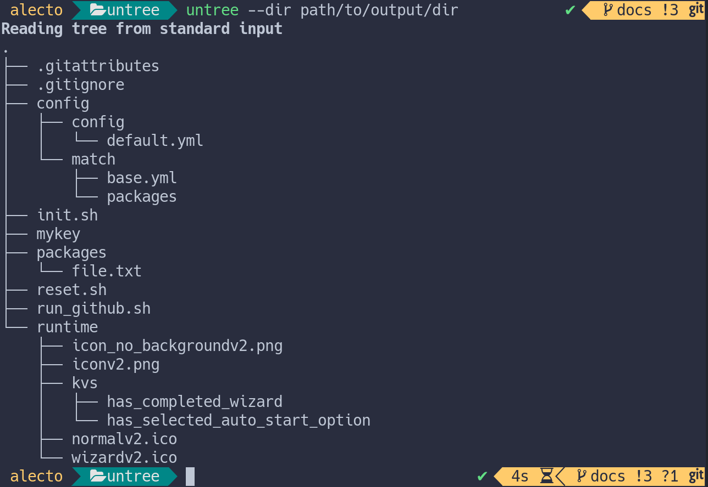
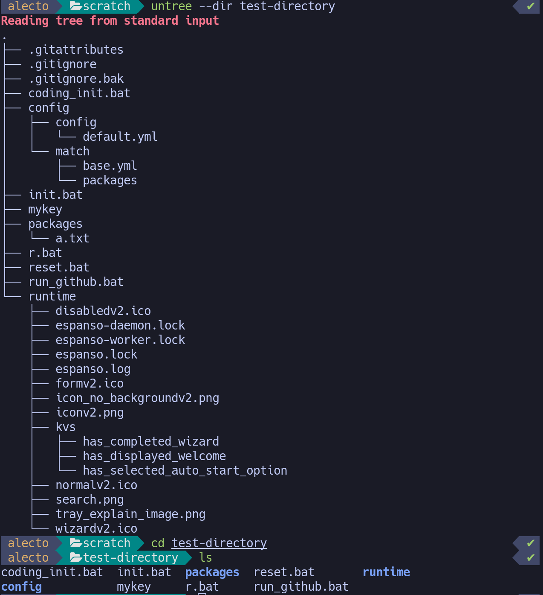

# Untree: Undoing tree for fun and profit

Untree converts tree diagrams produced by
[tree](https://linux.die.net/man/1/tree) back into directory file structures.

Let's say you have the following directory structure, created by running `tree`
in the root of this project:

```
.
├── Cargo.lock
├── Cargo.toml
├── inputs
│   └── test1.tree
├── README.md
└── src
    ├── macros.rs
    ├── main.rs
    ├── traits.rs
    └── types.rs

2 directories, 8 files
```

untree can mirror that directory structure, just based on that input:

```bash
tree | untree --dir test
```

Here, `test` is the destination directory where `untree` is supposed to create
files. Now, if we `tree` the newly created directory, we can see that it has the
same structure as the repository:

```
test
├── Cargo.lock
├── Cargo.toml
├── inputs
│   └── test1.tree
├── README.md
└── src
    ├── macros.rs
    ├── main.rs
    ├── traits.rs
    └── types.rs

2 directories, 8 files
```

`untree` can also read in the tree from an input file, or you can paste it in
directly since it accepts input from standard input:



## Motivating untree

I've noticed that in the past I've had to recreate directory structures in order
to answer questions or run tests on the directory. For example, [this
question][stack-overflow-question] asks about ignoring certain kinds of files,
and it provides a directory structure as reference.

The files themselves aren't provided, nor do they need to be, but the directory
structure itself _is_ relevant to the question.

`untree` allows you to exactly replicate the directory structure, just by
pasting in the given directory tree:



Aside from allowing you to answer questions about directory structures, untree
is good for quickly creating directory structures for the purpose of mocking
input to other programs.

[stack-overflow-question]:
  https://stackoverflow.com/questions/70933172/how-to-write-gitignore-so-that-it-only-includes-yaml-files-and-some-specific-fi

## Using untree as a library

You can use untree as a library if you need that functionality included in your
program. In order to create a tree, invoke `untree::create_tree` with the given
directory, `Lines` buffer, and options. These options are very simple - there's
`UntreeOptions::verbose`, which will print out any directories or files that
were created if true, and `UntreeOptions::dry_run`, which will print out any
directories or files without actually creating them (`dry_run` implies
`verbose`)

For more info, [see the documentation.][untree docs]

```rust
pub fn create_tree(
    directory: &String,
    mut lines: Lines<impl BufRead>,
    options: UntreeOptions,
)
```

Additional functions, such as `untree::create_path`, `untree::get_entry` (used
to parse a line in a tree file), `untree::touch_directory` (used to create a
directory, returning an `untree::Error` on failure), and `untree::file` (used to
touch a file, returning `untree::Error` on failure) are also provided.

The primary error type used by untree is [`untree::Error`][untree error], which
holds information about a path and the action being done on it, in addition to
the normal error information provided by `io::Error`.

[untree docs]: https://docs.rs/untree/latest/untree/all.html
[untree error]: https://docs.rs/untree/latest/untree/errors/enum.Error.html

## User testimonials

When asked about _untree_, my friend said:

> I retroactively want that for my time trying to get Conan to work. It woulda
> made certain things just a little less painful.

— _some guy_ (He asked to be referred to as "some guy")

## Comments, feedback, or contributions are welcome!

I'm in the progress of learning rust, so any feedback you have is greatly
appreciated! Also, if `untree` is useful to you, please let me know!
